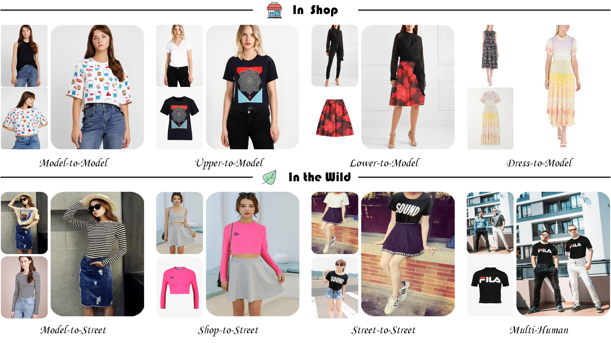
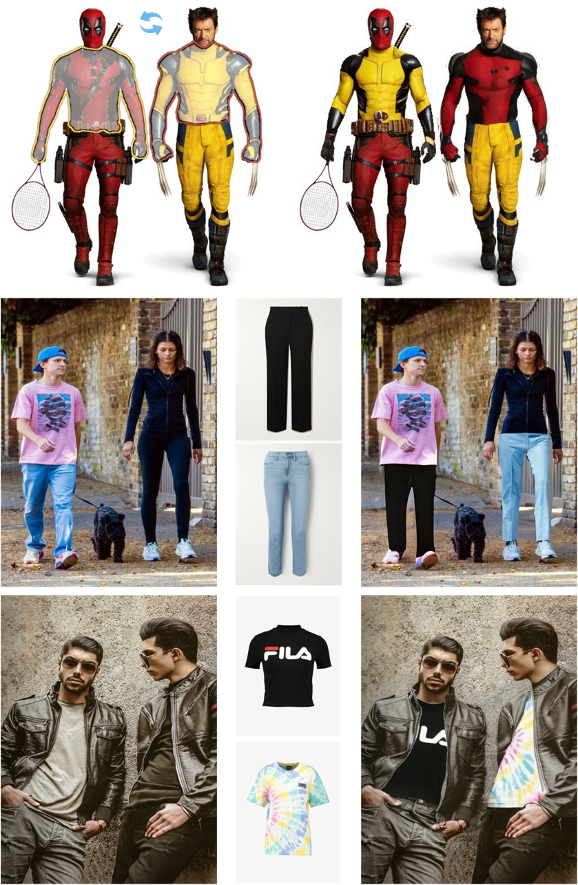

<div align="center">
<h1>OmniVTON: Training-Free Universal Virtual Try-On</h1>

<a href='https://arxiv.org/abs/2507.15037'></a>
[](https://creativecommons.org/licenses/by-nc/4.0/)


</div>

This is the official implementation of the paper:  
>**OmniVTON: Training-Free Universal Virtual Try-On**<br>  [Zhaotong Yang](https://github.com/Jerome-Young), [Yuhui Li](https://github.com/March-rain233), [Shengfeng He](https://www.shengfenghe.com/), [Xinzhe Li](https://github.com/lixinzhe-ouc), [Yangyang Xu](https://cnnlstm.github.io/), [Junyu Dong](https://it.ouc.edu.cn/djy_23898/main.htm), [Yong Du<sup>*</sup>](https://www.csyongdu.cn/) （ * indicates corresponding author)<br>
>Proceedings of the International Conference on Computer Vision

If interested, star 🌟 this project! 

---
&nbsp;

## Setup
To set up the environment, install requirements using Python 3.9:
```shell
conda create -n omnivton python=3.9
conda activate omnivton
pip install -r requirements.txt
```

## Data Preparation
### Agnostic Mask
Generate agnostic mask images following the operation provided by [CAT-DM](https://github.com/zengjianhao/CAT-DM).

### Text Prompt
Use the [clip-interrogator](https://github.com/pharmapsychotic/clip-interrogator) to obtain text prompts for both the target garment image and the original garment image.

- Note: If the original garment image is unavailable, you may extract it using a semantic segmentation model and then feed the result into the clip-interrogator.

Structure of the `condition` folder should be as follows:
```
condition dir
|-- image_clip_interrogate       # original garment prompt
    |-- xxx_ci.json
|-- cloth_clip_interrogate       # target garment prompt
    |-- xxx_ci.json
```

## Usage
### Stage 1
To generate a pseudo person image, run the following command:
```shell
python3.9 inference.py \
  --model-id sd2_inp \
  --image-path PERSON_IMAGE_PATH \
  --cloth-path CLOTHING_IMAGE_PATH \
  --in-mask-path AGNOSTIC_MASK_PATH \
  --out-mask-path CLOTHING_MASK_PATH \
  --condition-path CONDITION_DIR_PATH \
  --stage outpainting --H 512 --W 384 \
  --output-path OUTPUT_PATH
```
`--model-id` specifies the baseline model for virtual try-on. The following baseline models are supported by the script:
- `sd2_inp` - Stable Diffusion 2.0 Inpainting
- `sd15_inp` - Stable Diffusion 1.5 Inpainting

If not specified `--model-id` defaults to `sd2_inp`.

The script uses a combination of positive and negative prompts by default to achieve more visually appealing results.

On the first run, it will automatically download the required models — please be patient. Alternatively, you may choose to load models from a local directory.

### Stage 2
Once the pseudo person image is obtained, we need to extract both human part segmentation map and 25 keypoint coordinates for the pseudo person image and the original person image, using [TAPPS](https://github.com/tue-mps/tapps) and [OpenPose](https://github.com/CMU-Perceptual-Computing-Lab/openpose), respectively.

- Note: To facilitate the extraction of semantic maps, please replace the files in the **official TAPPS** directory with those provided in the `tapps` folder of this repository.

Then, the `condition` folder should be updated as follows:
```
condition dir
|-- image_clip_interrogate       # original garment prompt
    |-- xxx_ci.json
|-- image_tapps_parse            # original person segmentation map
    |-- xxx_pps.png
|-- image_openpose_json          # original person keypoints
    |-- xxx_keypoints.json
|-- cloth_clip_interrogate       # target garment prompt
    |-- xxx_ci.json
|-- cloth_tapps_parse            # pseudo person segmentation map
    |-- xxx_pps.png
|-- cloth_openpose_json          # pseudo person keypoints
    |-- xxx_keypoints.json
```

To generate the final try-on result, run the following command:
```shell
python3.9 inference.py \
  --model-id sd2_inp \
  --image-path PERSON_IMAGE_PATH \
  --cloth-path CLOTHING_IMAGE_PATH \
  --in-mask-path PERSON_MASK_PATH \
  --out-mask-path CLOTHING_MASK_PATH \
  --condition-path CONDITION_DIR_PATH \
  --stage vton --H 512 --W 384 \
  --output-path OUTPUT_PATH
```


---  

## Multi-Human Results

&nbsp;

## Acknowledgements
Thanks to [HD-Painter](https://github.com/Picsart-AI-Research/HD-Painter) for the base code.

Thanks to [CAT-DM](https://github.com/zengjianhao/CAT-DM) for the masking generation code.

Thanks to [TAPPS](https://github.com/tue-mps/tapps) and [OpenPose](https://github.com/CMU-Perceptual-Computing-Lab/openpose) for human parsing.


## Citation

If you find our work useful for your research, please cite us:
```
@article{yang2025omnivton,
  title={OmniVTON: Training-Free Universal Virtual Try-On},
  author={Yang, Zhaotong and Li, Yuhui and He, Shengfeng and Li, Xinzhe and Xu, Yangyang and Dong, Junyu and Du, Yong},
  journal={arXiv preprint arXiv:2507.15037},
  year={2025}
}
```